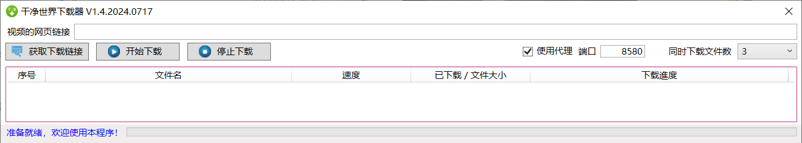
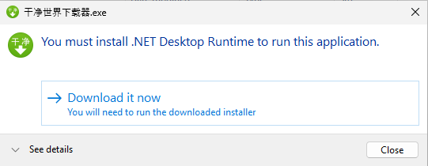
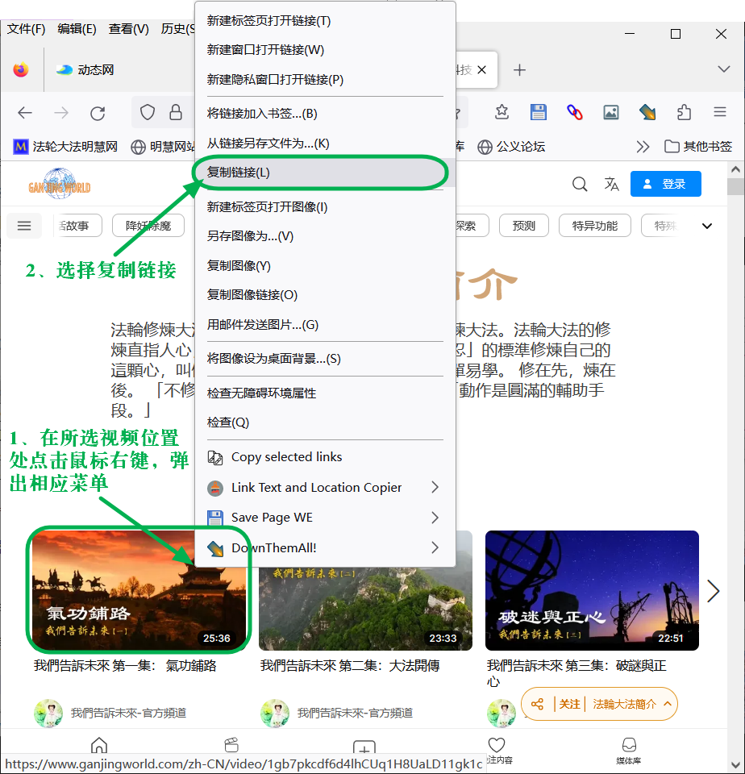
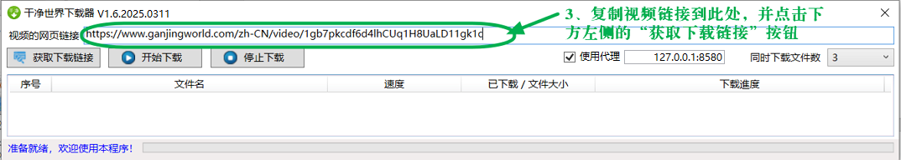
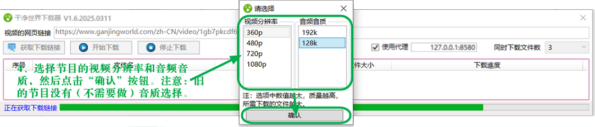
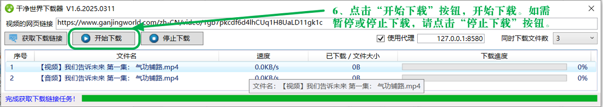

# 乾淨世界下載器

## 一、功能簡介

為便於廣泛傳播乾淨世界節目，包括其各類真相節目，讓眾人明真相，特製作此乾淨世界視頻節目下載器。

下載器使用和操作簡單，一次可以下載一個視頻節目，所有下載均可記憶上次下載位置，下次繼續從中斷點下載。
 
## 二、開發環境等

|  類別  |說明|
| :---   | :---        |
|開發工具	|VS2022 社區版|
|語言|C#|
|DotNet|8.0|
|Nuget引用庫|HtmlAgilityPack, HtmlAgilityPack.CssSelectors.NetCore, HttpToSocks5Proxy, Microsoft.NETFramework.ReferenceAssemblie, NETStandard.Library, Newtonsoft.Json, System.ValueTuple|
|添加且修改的專案|VideoDL-m3u8，根據代碼需要做了適當修改|

程式調試時，也需要參考“三、使用前的準備”中第2部分，將ffmpeg.exe放在所生成的可執行程序同一目錄下才能正常運行。

## 三、使用前的準備

使用前程式需要做好的準備： 

1、安裝微軟net Core8的桌上出版程式運行時，下載位址：
https://download.visualstudio.microsoft.com/download/pr/f18288f6-1732-415b-b577-7fb46510479a/a98239f751a7aed31bc4aa12f348a9bf/windowsdesktop-runtime-8.0.1-win-x64.exe

2、下載ffmpeg.exe（用於轉換乾淨世界視頻為 mp4）
在 https://github.com/BtbN/FFmpeg-Builds/releases 下載 ffmpeg-master-latest-win64-gpl.zip，解壓後在其下的 bin 目錄下找到 ffmpeg.exe，將其複製到當前程式目錄下。
此檔是在github上下載，只要把下載連結粘貼在流覽器位址欄回車後，如果沒有打開網頁，多刷新幾次，過一會就會連上，然後就可以下載了。因為這個檔比較大，大於100M，要耐心點。

3、如果使用自由門限製版下載乾淨世界節目，需按照第4部分【添加自由門白名單】的方法，把如下內容添加到其代理的白名單裡：
- .ganjingworld.com
- .cloudokyo.cloud
- .edgefare.net

4、【添加自由門白名單】的方法
（1）在自由門介面點擊“設置”(圖示為齒輪形狀的)；
（2）在設置視窗，點擊“自由門代理控制”按鈕；
（3）在自由門代理控制視窗，在第三個“只允許通過……”的旁邊，點擊“添加”按鈕，把上面的連接依次逐個輸入進去，記得前面有個小點。然後一路點擊確定就好了。

## 四、使用簡要說明

1、如果系統預先沒有安裝微軟net Core8運行時，運行程序后，系統會出現下載提示，

請點擊“Download it now”下載並安裝。此種情況下下載安裝的是微軟最新版的net Core8運行時。

2、獲取下載連結
打開乾淨世界網站，找到要下載的視頻頁面，在所在視頻上點擊右鍵，從彈出的功能表中選擇“複製連結”；

3、將得到的視頻連結粘貼到程式的“網頁連結”處；

4、點擊“獲取下載連結”，過程中會彈出選擇節目的視頻清晰度（最新的節目還有音訊品質選擇）的對話方塊，選擇後，點擊“確認”按鈕。獲取成功後，會在下載列表添加一個下載項；

5、點擊“開始下載按鈕”下載視頻，視頻下載後會自動合併轉換下載的內容為MP4檔。

下載完成後，MP4 檔保存在程式所在目錄下的 “下載”目錄裡，一個視頻單獨一個資料夾，如：《我們告訴未來 第一集： 氣功鋪路》就保存在“下載\我們告訴未來 第一集： 氣功鋪路”目錄下。

## 五、所使用或引用的專案

1、VideoDL-m3u8
https://github.com/fysh711426/VideoDL-m3u8

2、ffmpeg
https://github.com/BtbN/FFmpeg-Builds/releases

### 誠心感謝作者的付出！

## 六、鄭重聲明

#### 本專案僅為廣泛傳播乾淨世界節目，包括其各類真相節目，讓世人明真相所用而特別製作。
#### 下載的所有節目，請尊重節目的版權，請勿修改其任何內容，保證節目的完整。
#### 對於利用所下載的節目拼接、修改等以達到其各種不善目的的，請懸崖勒馬。蒼天在上，莫要做此等壞事，害己害人，絕不可取。
#### 對於下載節目，用於廣傳真相的可貴的善良的世人，感謝您的付出！您的善舉將會給您帶來美好的未來！
